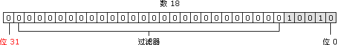

# 位运算符

- 位运算符是在数字底层，即表示数字的32个数位，进行操作的。

## 重温整数

- ECMAScript整数有两种类型。即有符号整数(允许用正数和负数)和无符号整数(只允许用正数).
  - 在ECMAScript中所有整数字面量默认都是有符号整数。
- 有符号整数使用31位表示整数的数值，用第32位表示整数的符号，0表示正数，1表示负数。
  - 数值范围从-2147483648到设置2147483647。
- 可以以两种不同的方式存储二进制形式的有符号整数，一种用于存储正数，一种用于存储负数。
  - 正数是以真二进制形式存储的，前31位中的每一位都表示2的幂，从第一位开始，表示2的0次方，以此类推，没用到的位用0填充，即忽略不计。
  - 下图展示的是数18的表示法
    
  - 18的二进制版本只用了前5位，它们是这个数字的有效位。
- 负数也存储为二进制代码，不过采用的形式是二进制补码。
  - 计算数字二进制补码的步骤有三步:
    - 确定该数字的非负版本的二进制表示(例如，要计算-18的二进制补码，首先要确定18的二进制表示)
    - 求得二进制反码，即要把0替换为1，把1替换为0
    - 在二进制反码上加1
  - 在处理有符号整数时，开发者不能访问31位。
- 把负数转换成二进制字符串以后，ECMAScript并不以二进制补码的形式显示，而是用数字绝对值的标准二进制代码前面加负号的形式输出。
    ```js
    var iNum = -18;
    console.log(iNum.toString(2));
    ```
  - 这是为了避免访问位31。
- 无符号整数把最后一位作为另一个数位处理，在这种模式中，第32位不表示数字的符号，而是值2的31次幂。
  - 由于这个额外的位，无符号整数的数值范围为0到4294967295。
  - 对于小于2147483647的整数来说，无符号整数看来与有符号整数一样。
    - 而大于2147483647的整数则要使用位31，在有符号整数中，这一位总是0.
  - 把无符号整数转换成字符串以后，只返回它们的有效位。
- 所有整数字面量都默认存储有符号整数。
  - 只有ECMAScript的位运算符才能创建无符号整数。

## 位运算NOT

- 位运算NOT由否定号(~)表示。
- 位运算NOT处理过程有三步:
  1. 把运算数转换成32位数字
  2. 把二进制数转换成它的二进制反码
  3. 把二进制数转换成浮点数
- 位运算NOT实质上是对数字求负，然后减1。

## 位运算AND

- 位运算AND由和号(&)表示，直接对数字的二进制形式进行运算。
  - 它把每个数字中的数位对齐，然后对同一位置上的两个数位进行AND运算

| 第一个数字中的数位 | 第二个数字中的数位 | 结果 |
| :-------------: | :-------------: | :-: |
| 1 | 1 | 1 |
| 1 | 0 | 0 |
| 0 | 1 | 0 |
| 0 | 0 | 0 |

## 位运算OR

- 位运算OR由符号(|)表示，也是直接对数字的二进制进行运算。

| 第一个数字中的数位 | 第二个数字中的数位 | 结果 |
| :-------------: | :-------------: | :-: |
| 1 | 1 | 1 |
| 1 | 0 | 1 |
| 0 | 1 | 1 |
| 0 | 0 | 0 |

## 位运算XOR

- 位运算XOR由符号(^)表示，一样的也是对二进制形式进行运算。
  - 但是不同于OR，只有一个数位存放的是1时，才返回1.

| 第一个数字中的数位 | 第二个数字中的数位 | 结果 |
| :-------------: | :-------------: | :-: |
| 1 | 1 | 0 |
| 1 | 0 | 1 |
| 0 | 1 | 1 |
| 0 | 0 | 0 |

## 左移运算

- 左移运算由两个小于号表示(<<)，把数字中所有的数位向左移动指定的数量。
  - 在左移数位时，数字右边多出的空位，左移运算用0填充这些空位，使结果成为完整的32位数字。
    
  - 左移运算保留数字的符号位，如果把-2左移5位，得到的是-64，而不是64.

## 有符号右移运算

- 有符号右移运算符由两个大于号表示(>>)，它把32位数字中的所有数位整体右移，同时保留该数的符号(正号或负号).
  - 有符号右移运算符恰好与左移相反。
  - 移动数位后会造成空位，空位位于数字的左侧，但位于符号位之后。ECMAScript用符号位的值填充这些空位，创建完整的数字。

## 无符号右移运算

- 无符号右移运算符由三个大于号表示，它将无符号32位数的所有数位整体右移。
  - 对于正数，无符号右移运算的结果与有符号右移运算一样。
  - 对于负数，无符号右移运算用0填充所有空位，对于正数，这与有符号右移运算的操作一样，而负数则被作为正数来处理。
- 由于无符号右移运算的结果是一个32位的正数，所以负数的无符号右移运算得到的总是一个非常大的数字。