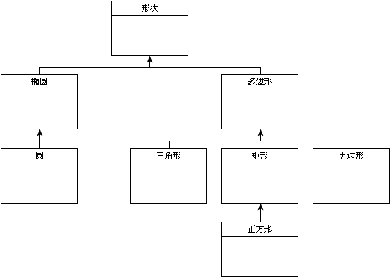

# ECMAScript继承机制实例

- 说明继承机制最简单的方式是，利用一个经典例子-几何形状。
  - 实际上，几何形状只有两种即椭圆形和多边形。
    - 圆是椭圆的一种，它只有一个焦点。
    - 三角形、矩形和五边形都是多边形的一种，具有不同数量的边
    - 正方形是矩形的一种，所有的边等长
  - 以上这些特点构成了一种完美的继承关系。
  - 在这个例子中，形状是椭圆形和多变的基类(所有类都由它继承而来).
    - 椭圆有一个属性说明椭圆具有的焦点个数，圆形继承了椭圆形，因此圆形是椭圆形的子类。
      - 椭圆形是圆形的超类。
    - 三角形、矩形和五边形都是多边形的子类。
      - 多边形是它们的超类，正方形继承了矩形。

- UML(统一建模语言)的主要用途之一就是可视化地表示像继承这样复杂对象关系。
  - 下图是解释Shape和它的子类之间关系的UML图示
    
  - 在UML中，每个方框表示一个类，由类名说明。
    - 三角形、矩形和五边形顶部的线段汇集在一起，指向形状，说明这些类都由形状继承而来。
    - 从正方形指向矩形的箭头说明了它们之间的继承关系。
