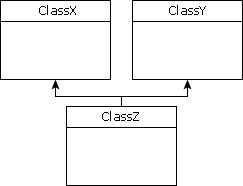

# ECMAScript继承机制实现

- 要用ECMAScript实现继承机制，可以从要继承的基类入手，所有开发者定义的类都可作为基类。
  - 因为安全原因，本地类和宿主类不能作为基类。
  - 这样可以防止公用访问编译过的浏览器级的代码，因为这些代码可以被用于恶意攻击。

- 选定基类后，就可以创建它的子类了;如果想创建一个不能直接使用的基类，只是用于给子类提供通用的函数，这种情况下基类被看作抽象类。
  - 尽管ECMAScript没有严格定义抽象类，但它的确会创建一些不允许使用的类，通常称这种类为抽象类。

- 创建的子类将继承超类的所有属性和方法，包括构造函数及方法的实现，所有属性和方法都是公用的，子类可直接访问这些方法。
  - 子类还可以添加超类中没有的新属性和方法，也可以覆盖超类的属性和方法。

## 继承的方式

- 和其他功能一样，ECMAScript实现继承的方式不止一种。
  - 因为JS中的继承机制并不是明确规定的，而是通过模仿实现的。
  - 这意味着所有的继承细节并非完全由解释程序处理，开发者有权决定最适用的继承方式。

## 对象冒充

- 对象冒充是在开发者开始理解函数的工作方式，尤其是如何在函数环境中使用this关键字后才发展出来。

- 对象冒充的原理如下: 构造函数使用this关键字给所有属性和方法赋值(即采用类声明的构造函数方式)。
  - 因为构造函数只是一个函数，所以可使ClassA构造函数成为ClassB的方法，然后调用它
    - ClassB就会收到ClassA的构造函数中定义的属性和方法。
      ```js
      //关键字this引用的是构造函数当前创建的对象，但在这个方法中this指向的是所属的对象,这个原理是把ClassA作为常规函数来建立继承机制，而不是作为构造函数
      function ClassA(sColor) {
        this.color = sColor;
        this.sayColor = function() {
          console.log(this.color);
        };
      }

      function ClassB(sColor) {
      }

      //如下使用构造函数ClassB可以实现继承机制
      //在这段代码中，为ClassA赋予方法newMethod(函数名只是指向它的指针),调用该方法，传递给它的是ClassB构造函数的参数sColor
      //最后一行代码删除了对ClassA的引用，以后就不能再调用它
      function ClassB(sColor) {
        this.newMethod = ClassA;
        this.newMethod(sColor);
        delete this.newMethod;
      }

      //所有新属性和新方法都必须在删除了新方法的代码行后进行定义,否则可能会覆盖超类的相关属性和方法:
      function ClassB(sColor, sName) {
        this.newMethod = ClassA;
        this.newMethod(sColor);
        delete this.newMethod;

        this.name = sName;
        this.sayName = function() {
          console.log(this.name);
        }
      }

      var objA = new ClassA("blue");
      var objB = new ClassB("red", "John");
      objA.sayColor();
      objB.sayColor();
      objB.sayName();
      ```

### 对象冒充可以实现多重继承

- 多重继承的意思就是一个类可以继承多个超类，用UML表示的多重继承机制如下:
  
- 例如:如果存在两个类ClassX和ClassY,ClassZ想继承这两个类，代码如下:
    ```js
    function ClassZ() {
      this.newMethod = ClassX;
      this.newMethod();
      delete this.newMethod;

      this.newMethod = ClassY;
      this.newMethod();
      delete this.newMethod;
    }
  - 这里存在一个弊端，如果存在两个类ClassX和ClassY具有同名的属性或方法，ClassY具有高优先级，因为它从后面的类继承。

  - 由于这种继承方法的流行，ECMAScript第三版为Function对象加入了两个方法:call()和apply().

#### call()方法

- call()方法是与经典的对象冒充方法最相似的方法，它的第一个参数用作this的对象，其他参数都直接传递给函数自身，例如
    ```js
    //下面的代码中，函数sayColor()在对象外定义，即使它不属于任何对象，也可以引用关键字this,
    function sayColor(sPrefix, sSuffix) {
      console.log(sPrefix + this.color + sSuffix);
    };

    var obj = new Object();
    obj.color = "blue";

    sayColor.call(obj, "The color is", "a very nice color indeed.");

    //要与继承机制的对象冒充方法一起使用该方法，只需将前三行的赋值、调用和删除代码替换即可
    //这里需要让ClassA的关键字this等于新创建的ClassB对象，因此this是第一个参数，第二个参数sColor对两个类来说都是唯一的参数
    function ClassB(sCOlor, sName) {
      //this.newMethod = ClassA;
      //this.newMethod(color);
      //delete this.newMethod;
      ClassA.call(this, sColor);

      this.name = sName;
      this.sayName = function () {
        console.log(this.name);
      };
    }

#### apply()方法

- apply()方法有两个参数，用作this的对象和要传递给函数的参数的数组，例如：
    ```js
    //调用apply()方法时，第一个参数仍是obj
    function sayColor(sPrefix, sSuffix) {
      console.log(sPrefix + this.color +sSuffix);
    };

    var obj = new Object();
    obj.color = "blue";

    sayColor.apply(obj, new Array("The color is ", "a very nice color indeed."));

    //该方法同样也用于替换前三行的赋值、调用和删除新方法的代码:
    //第一个参数仍是this,可以把ClassB的整个arguments对象作为第二个参数传递给apply()方法
    functiuon ClassB(sColor, sName) {
      //this.newMethod = ClassA;
      //this.newMethod(color);
      //delete this.newMethod;
      ClassA.apply(this, new Array(sColor));

      this.name = sName;
      this.sayName = function() {
        console.log(this.name);
      }
    }
    ```
- 只有超类中的参数顺序与子类中的参数顺序完全一致时才可以传递参数对象。
  - 如果不是就必须创建一个单独的数组，按照正确的顺序放置参数

## 原型链

- 继承这种形式在ECMAScript中原本是用于原型链的，原型链扩展了定义类的原型方式。

- prototype对象是个模板，要实例化的对象都以这个模板为基础。prototype对象的任何属性和方法都被传递给那个类的所有实例，原型链利用这种功能来实现继承机制。

- 如果用原型链方式重新定义之前例子中的类，它们将变成下列形式:
    ```js
    function ClassA() {

    }

    ClassA.prototype.color = "blue";
    ClassA.prototype.sayColor = function() {
      console.log(this.color);
    }

    function ClassB() {

    }

    //下面这行代码是把ClassB的prototype属性设置成ClassA的实例
    ClassB.prototype = new ClassA();

    //调用ClassA的构造函数，没有传递参数，在原型链中是标准做法，确保构造函数没有任何参数

    //与对象冒充相似，子类的所有属性和方法都必须出现在prototype属性被赋值后，因为载她之前赋值的所有方法都会被删除
    //因为prototyp属性被替换成了新对象，添加了新方法的原始对象将被销毁
    //为ClassB类添加name属性和sayName()方法的代码如下:
    function ClassB() {

    }
    ClassB.prototype = new ClassA();

    ClassB.prototype.name = "";
    ClassB.prototype.sayName = function() {
      console.log(this.name);
    }

    var objA = new ClassA();
    var objB = new ClassB();
    objA.color = "blue";
    objB.color = "red";
    objB.name = "John";
    objA.sayColor();
    objB.sayColor();
    objB.sayName();
    ```

- 在原型链中，instanceof运算符的运行方式也很独特，对ClassB的所有实例，instanceof为ClassA和ClassB都返回true。
- 在使用对象冒充时不能使用instanceof，原型链的弊端是不支持多重继承，原型链会用另一类型的对象重写类的prototype属性。

## 混合方式

- 这种继承方式使用构造函数定义类，并非使用任何原型，对象冒充的问题是必须使用构造函数方式，这不是最好选择，但如果使用原型链，就没办法使用带参数的构造函数。

- 创建类的最好方式是用构造函数定义属性，用原型链定义方法，这种方式同样适用于继承机制，用对象冒充继承构造函数的属性，用原型链继承prototype对象的方法。
    ```js
    function ClassA(sColor) {
      this.color = sColor;
    }

    ClassA.prototype.sayColor = function() {
      console.log(this.color);
    }

    function ClassB(sColor, sName) {
      //下面这行代码用对象冒充继承ClassA类的sColor属性
      ClassA.call(this, sColor);
      this.name = sName;
    }

    //下面这行代码用原型链继承ClassA类的方法
    ClassB.prototype = new ClassA();

    ClassB.prototype.sayName = function() {
      console.log(this.name);
    }

    //由于上面这种混合方式使用了原型链，所以instanceof运算符仍能正确运行
    var objA = new ClassA("blue");
    var objB = new ClassB("red", "John");
    objA.sayColor();
    objB.sayColor();
    objB.sayName();
    ```